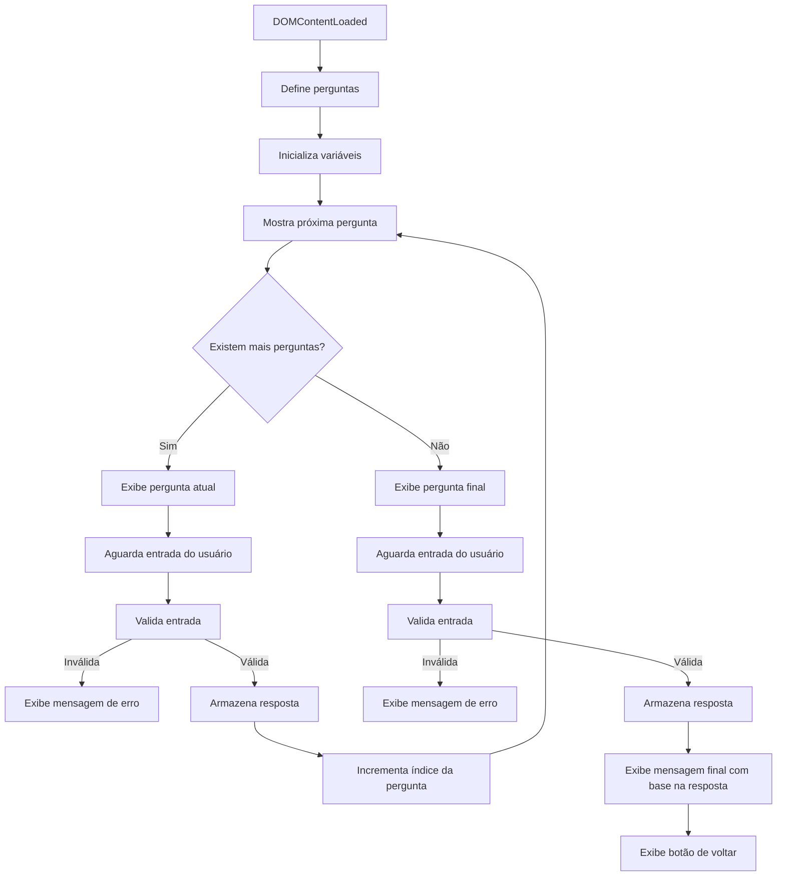

# 7-Days-Of-Code-JavaScript-ONE-Alura

Repositório dedicado aos desafios diários da campanha #7daysofcode, uma iniciativa da Alura em parceria com o ONE (Oracle Next Education). Aqui você encontrará soluções, códigos e materiais relacionados aos desafios práticos propostos, que abrangem desde estruturas de controle de fluxo até funções e manipulação de dados.


# 🚧 EM CONSTRUÇÃO 🏗️

# Day 1

Data: 25/02/2025

## Problema 

No JavaScript, a comparação de valores pode levar a comportamentos inesperados devido à conversão implícita de tipos. Por exemplo, expressões como `false == '0'`, `null == undefined `, `\t\r\n" == 0`, ou `' ' == 0`  retornam true, o que pode causar erros sutis no código.

## Tarefa

Neste desafio, você deve corrigir o código fornecido para que as comparações entre variáveis de tipos diferentes (números e strings) sejam feitas de forma correta e previsível. O objetivo é garantir que o código imprima mensagens precisas sobre o valor e o tipo das variáveis comparadas.

```javascript
let numeroUm = 1
let stringUm = '1'
let numeroTrinta = 30
let stringTrinta = '30'
let numeroDez = 10
let stringDez = '10'

if (COMPARAR O numeroUm e a stringUm) {
  console.log('As variáveis numeroUm e stringUm tem o mesmo valor, mas tipos diferentes')
} else {
  console.log('As variáveis numeroUm e stringUm não tem o mesmo valor')
}

if (COMPARAR O numeroTrinta e a stringTrinta) {
  console.log('As variáveis numeroTrinta e stringTrinta tem o mesmo valor e mesmo tipo')
} else {
  console.log('As variáveis numeroTrinta e stringTrinta não tem o mesmo tipo')
}

if (COMPARAR O numeroDez e a stringDez) {
  console.log('As variáveis numeroDez e stringDez tem o mesmo valor, mas tipos diferentes')
} else {
  console.log('As variáveis numeroDez e stringDez não tem o mesmo valor')
}
```

## Solução

Primeiramente precisamos voltar aos fundamentos, e relembrar dos operadores de comparação em JavaScript e como eles funcionam.

### Operadores de comparação

Em JavaScript, os operadores de comparação são usados para comparar dois valores e retornar um valor booleano (true ou false). Aqui estão todos os operadores de comparação disponíveis:

| Operador 	| Operação               	|
|:--------:	|------------------------	|
|     >    	| Maior que              	|
|     <    	| Menor que              	|
|    >=    	| Maior ou igual         	|
|    <=    	| Menor ou igual         	|
|    ==    	| Igual a                	|
|    !=    	| Diferente de           	|
|    ===   	| Estritamente igual     	|
|    !==   	| Estritamente não igual 	|
|    &&    	| E (and)                	|
|   \|\|   	| Ou (Or)                	|

Para o problema exposto, precisamos nos atentar aos operadores de igualdade == e ===.

### Operadores de igualdade == e ===

O operador de igualdade `==` compara dois valores e retorna true se eles são iguais, realizando conversão de tipo se necessário. E o `===` verifica se os valores e os tipos são iguais (sem conversão de tipo).

Não entendeu? Vou descomplicar para você!

Vamos imaginar o seguinte cenário:

Francisca tem dois filhos: João e Maria. Ambos gostam de maçãs.

- João: Um menino muito exigente que só gostava de maçãs vermelhas, daquelas bemmmm vermelhas (Maçã Argentina). 
- Maria: Uma menina que gostava de qualquer tipo de maçã (não ligava para o tipo, só para o sabor).


Um dia, a mãe foi à feira e comprou quatro tipos de maçãs:

- Uma maçã Argentina (tipo: vermelha).
- Uma maçã Fuji (tipo: vermelha-clara).
- Uma maçã Verde (tipo: verde).
- Uma maçã de crochê (tipo: fio, mas com aparência de maçã vermelha).


Quando voltou para casa, a mãe decidiu oferecer as maçãs aos filhos.

Primeiro ela tirou a maçã de crochê da sacola e perguntou aos seus filhos quem queria comer a maçã de crochê.

Maria (não exigente) e João (exigente) olharam para a maçã de crochê e disseram: "Não! Eu não quero essa maçã. Ela não é uma maçã de verdade!"


Depois disso, a mãe ofereceu a maçã Fuji (vermalha-claro) e a maçã verde aos filhos.

João (exigente) olhou para a maçã Fuji, analisou ela, olhou pra cor, o tamanho, o cheiro, e disse: "Não! Essa não é a maçã que eu gosto. Eu não quero essa maçã!". Logo em seguida, olhou para a maçã verde e disse: "Não! Essa nem vermelha é! Eca! Eu não quero essa maçã também!".

Maria (não exigente) olhou para as maçãs e disse: "Eu quero essas maçãs! As duas parecem deliciosas!".


Por último, a mãe ofereceu a maçã Argentina (vermelha) aos filhos.

João começou a analisar novamente, cada detalhe dela, e falou: "Sim, essa é a maçã que eu gosto! Eu quero!"

Maria olhou para a maçã Argentina e disse: "Sim, eu tambem quero essa maçã!".


Podemos fazer um parelho entre o João e a Maria com o operador de igualdade `==` e `===`:

- João (===): Exigente, só aceita se for exatamente igual (valor e tipo).
- Maria (==): Flexível, aceita se parecer igual (valor, mesmo que o tipo seja diferente).

Agora que você já entendeu os operadores de comparação, conseguimos resolver o problema!

### Resolução do problema

#### Mesmo valor e mesmo tipo

Essa primeira parte do problema é bem simples. Como os valores são iguais e os tipos também, podemos usar somente o operador de igualdade `===`.

```javascript
let numeroTrinta = 30
let stringTrinta = '30'

if (COMPARAR O numeroTrinta e a stringTrinta) {
  console.log('As variáveis numeroTrinta e stringTrinta tem o mesmo valor e mesmo tipo')
} else {
  console.log('As variáveis numeroTrinta e stringTrinta não tem o mesmo tipo')
}
```

```javascript
let numeroTrinta = 30
let stringTrinta = '30'

if (numeroTrinta === stringTrinta) {
  console.log('As variáveis numeroTrinta e stringTrinta tem o mesmo valor e mesmo tipo')
} else {
  console.log('As variáveis numeroTrinta e stringTrinta não tem o mesmo tipo')
}
```

#### Mesmo valor, mas tipos diferentes

Na segunda parte do problema, precisamos verificar se os valores são iguais, mas os tipos são diferentes. Em uma primeira perspectiva não podemos usar o operador `===`, pois ele verifica se os valores e os tipos são iguais. E nesse caso os tipos são diferentes. Portanto ele retorna `false`.

Portanto podemos usar o operador `==` e verificar se os valores são iguais. 

**E** logo em seguida podemos verificar se os tipos são iguais com o operador `===`. Sabemos que o resultado dessa comparação é `false`, pois os tipos são diferentes. Então podemos inverter o resultado com o operador de negação `!`, para que ele retorne `true`, e entre no bloco do if.

```javascript
let numeroUm = 1
let stringUm = '1'

if (COMPARAR O numeroUm e a stringUm) {
  console.log('As variáveis numeroUm e stringUm tem o mesmo valor, mas tipos diferentes')
} else {
  console.log('As variáveis numeroUm e stringUm não tem o mesmo valor')
}
```

```javascript
let numeroUm = 1
let stringUm = '1'

if ( (numeroUm == stringUm) && !(numeroUm === stringUm) ) {
  console.log('As variáveis numeroUm e stringUm tem o mesmo valor, mas tipos diferentes')
} else {
  console.log('As variáveis numeroUm e stringUm não tem o mesmo valor')
}
```

#### Mesmo valor, mas tipos diferentes

Na terceira parte do problema, podemos repetir o mesmo processo que fizemos na segunda parte do problema.

```javascript
let numeroDez = 10
let stringDez = '10'

if (COMPARAR O numeroDez e a stringDez) {
  console.log('As variáveis numeroDez e stringDez tem o mesmo valor, mas tipos diferentes')
} else {
  console.log('As variáveis numeroDez e stringDez não tem o mesmo valor')
}
```

```javascript
let numeroDez = 10
let stringDez = '10'

if ( (numeroDez == stringDez) && !(numeroDez === stringDez) ) {
  console.log('As variáveis numeroDez e stringDez tem o mesmo valor, mas tipos diferentes')
} else {
  console.log('As variáveis numeroDez e stringDez não tem o mesmo valor')
}
```

#### EXTRA - Mesmo tipo, mas valores diferentes

No desafio, eu senti falta de comparar se as variáveis tem o mesmo tipo, mas valores diferentes. Afinal comparamos:

| Tipo 	| Valor               	|
|:--------:	|------------------------	|
|     Igual    	| Igual             	|
|     Igual  	| Diferente              	|
|    Diferente     	| Igual        	|
|    Diferente    	| Diferente        	|

Pra definir isso, podemos usar o operador `typeof`, que ele retorna o tipo da variável. Como por exemplo:

- `undefined`: O valor é indefinido.
- `boolean`: O valor é um booleano (true ou false).
- `number`: O valor é um número.
- `string`: O valor é uma texto.
- `function`: O valor é uma função.
- `object`: O valor é um objeto.

Então eu posso simplesmente "gerar" o tipo de uma variável e comparar com o tipo da outra variável.

```javascript
let numeroUm = 1
let numeroTrinta = 30

if ( (typeof numeroUm === typeof numeroTrinta) && (numeroUm != numeroTrinta) ){
    console.log('As variáveis numeroUm e numeroTrinta tem o mesmo tipo, mas valores diferentes')
}else if ( (typeof numeroUm === typeof numeroTrinta) && (numeroUm == numeroTrinta) ){
    console.log('As variáveis numeroUm e numeroTrinta tem o mesmo tipo, mas valores iguais')
} else {
  console.log('As variáveis numeroUm e numeroTrinta não tem o mesmo tipo, nem mesmo valor')
}
```

# Day 2

Data: 26/02/2025

## Problema

Neste desafio, você vai desenvolver um programa simples que simula a experiência de um site ou aplicativo ao receber um novo usuário. O objetivo é capturar informações pessoais do usuário e exibir uma mensagem de boas-vindas personalizada.

O programa deve fazer três perguntas ao usuário:

- Qual o seu nome?
- Quantos anos você tem?
- Qual linguagem de programação você está estudando?

À medida que o usuário responde a cada pergunta, o programa deve armazenar essas informações. No final, o sistema exibirá uma mensagem personalizada no seguinte formato:

```
"Olá [nome], você tem [idade] anos e já está aprendendo [linguagem]!"
```

Onde [nome], [idade] e [linguagem] são as respostas fornecidas pelo usuário.


## Tarefa

- Implemente um programa que faça as três perguntas ao usuário.
- Armazene as respostas em variáveis.
- Exiba a mensagem de boas-vindas personalizada com as informações coletadas.

#### Dica:
- Utilize funções de entrada e saída, como prompt() no JavaScript, para capturar as respostas do usuário.

#### Exercício Opcional

Depois de exibir a mensagem anterior, o programa pergunte:

```
Você gosta de estudar [linguagem]? Responda com o número 1 para SIM ou 2 para NÃO.
```

E aí, dependendo da resposta, ele deve mostrar uma das seguintes mensagens:

```
1 > Muito bom! Continue estudando e você terá muito sucesso.

2 > Ahh que pena... Já tentou aprender outras linguagens?
```

## Solução



# Day 3

Data: /02/2025

## Problema

## Tarefa

## Solução

# Day 4

Data: /02/2025

## Problema

## Tarefa

## Solução

# Day 5

Data: /02/2025

## Problema

## Tarefa

## Solução

# Day 6

Data: /02/2025

## Problema

## Tarefa

## Solução

# Day 7

Data: /02/2025

## Problema

## Tarefa

## Solução

# 🖥️ Contribuição

Contribuições são bem-vindas! Se você deseja contribuir para este projeto, siga os passos abaixo:

1. Faça um fork do repositório.
2. Crie uma branch para sua feature (`git checkout -b feature/nova-feature`).
3. Commit suas mudanças (`git commit -m 'Adicionando nova feature'`).
4. Push para a branch (`git push origin feature/nova-feature`).
5. Abra um Pull Request.

# 🛡️ Licença

Este projeto está sob a licença MIT. Isso significa que você pode utilizá-lo, modificá-lo e distribuí-lo livremente, desde que mantenha os créditos.

# 📧 Contato

Se você tiver alguma dúvida ou sugestão, sinta-se à vontade para entrar em contato:

- GitHub: [JuliaComG](https://github.com/JuliaComG)
- Linkdin: https://www.linkedin.com/in/giulia-armanelli/
- Email: garmanelli.dev@gmail.com

# 💖 Créditos e Agradecimentos 

Quero agradecer à [Alura](https://github.com/alura-cursos) e à [Oracle](https://github.com/oracle) pelo conhecimento compartilhado e pelas oportunidades proporcionadas por meio do programa [**<Hello, ONE!>**.](https://www.oracle.com/br/education/oracle-next-education/)