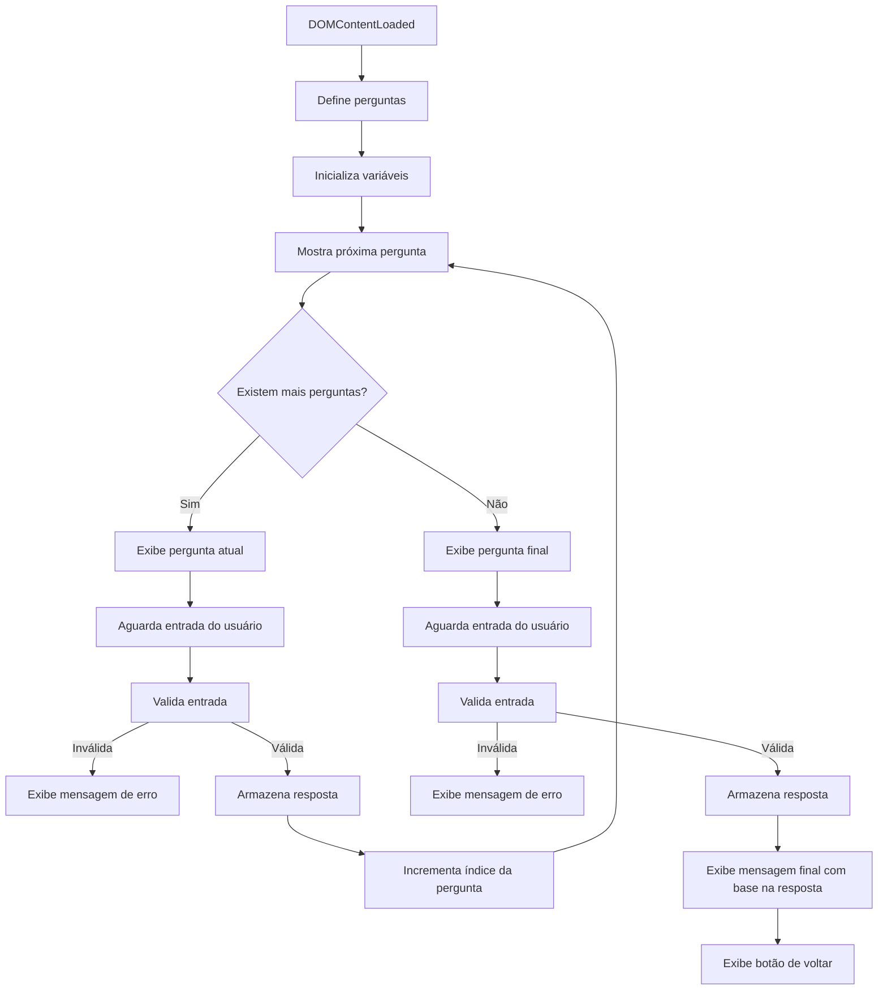
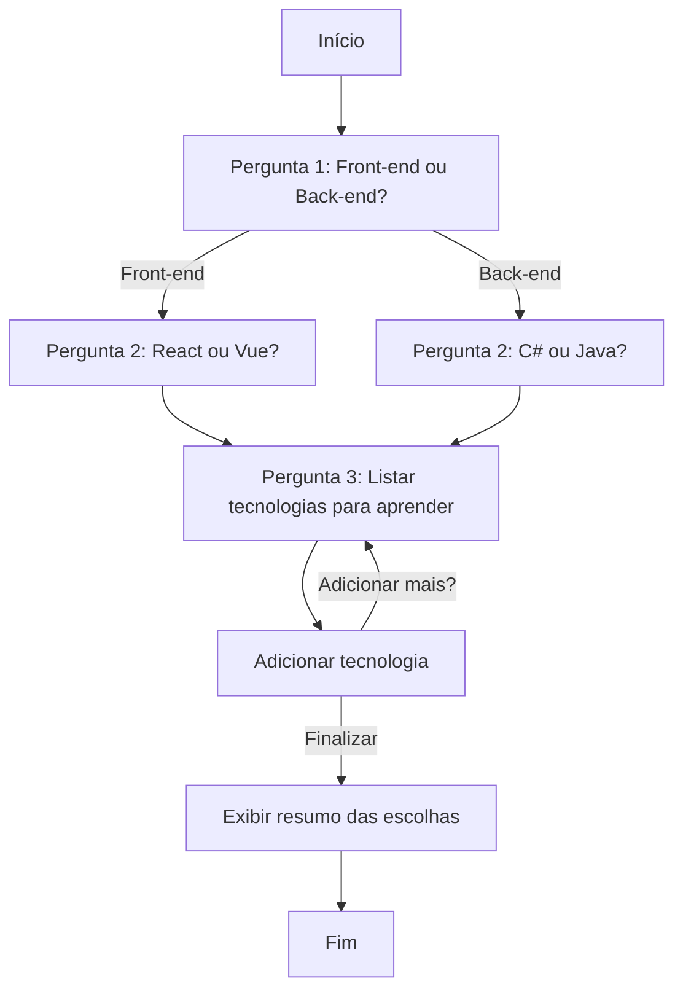
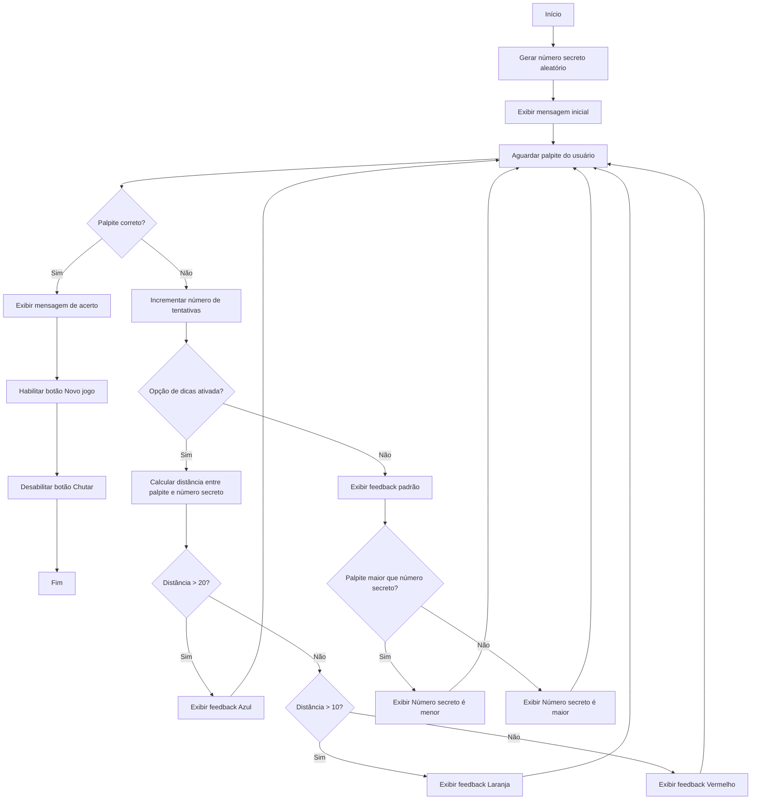
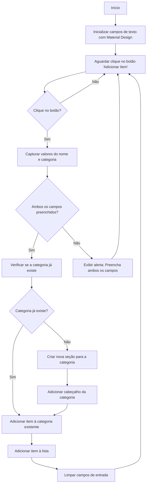
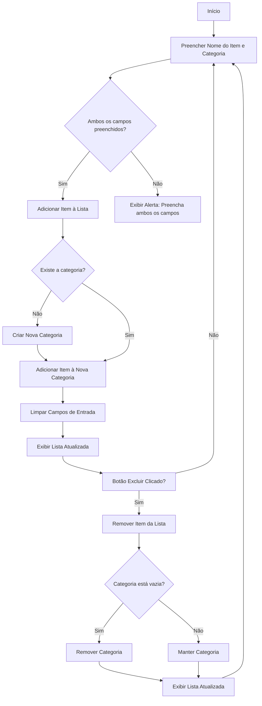
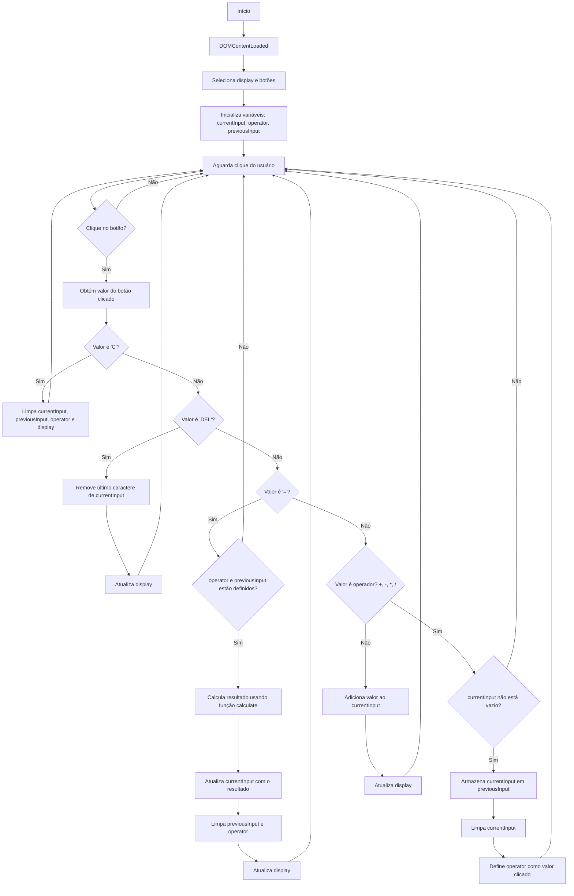



<p align="center">
  <a href="https://juliacomg.github.io/7-Days-Of-Code-JavaScript-ONE-Alura/">🌍 Acesse o Hub aqui</a>
</p>


Repositório dedicado aos desafios diários da campanha #7daysofcode, uma iniciativa da Alura em parceria com o ONE (Oracle Next Education). Aqui você encontrará soluções, códigos e materiais relacionados aos desafios práticos propostos, que abrangem desde estruturas de controle de fluxo até funções e manipulação de dados.

<p align="center">
  <a href="#day-1">Dia 1</a>&nbsp;&nbsp;&nbsp;|&nbsp;&nbsp;&nbsp;
  <a href="#day-2">Dia 2</a> &nbsp;&nbsp;&nbsp;|&nbsp;&nbsp;&nbsp;
  <a href="#day-3">Dia 3</a> &nbsp;&nbsp;&nbsp;|&nbsp;&nbsp;&nbsp;
  <a href="#day-4">Dia 4</a> &nbsp;&nbsp;&nbsp;|&nbsp;&nbsp;&nbsp;
  <a href="#day-5">Dia 5</a> &nbsp;&nbsp;&nbsp;|&nbsp;&nbsp;&nbsp;
  <a href="#day-6">Dia 6</a> &nbsp;&nbsp;&nbsp;|&nbsp;&nbsp;&nbsp;
  <a href="#day-7">Dia 7</a>
</p>


#7DaysOfCode #JavaScript #ONE #Alura #Oracle

# Tecnologias Utilizadas
- HTML5: Estruturação da página web.
- CSS3: Estilização e design responsivo.
- JavaScript: Lógica de programação e interatividade.
- Material Design 3: Framework. Sistema de design open source do Google, que oferece diretrizes, estilos e componentes para criar interfaces amigáveis.

# Day 1

Data: 25/02/2025

[🌍 Acesse o resultado](https://juliacomg.github.io/7-Days-Of-Code-JavaScript-ONE-Alura/day1.html)

## Problema 

No JavaScript, a comparação de valores pode levar a comportamentos inesperados devido à conversão implícita de tipos. Por exemplo, expressões como `false == '0'`, `null == undefined `, `\t\r\n" == 0`, ou `' ' == 0`  retornam true, o que pode causar erros sutis no código.

## Tarefa

Neste desafio, você deve corrigir o código fornecido para que as comparações entre variáveis de tipos diferentes (números e strings) sejam feitas de forma correta e previsível. O objetivo é garantir que o código imprima mensagens precisas sobre o valor e o tipo das variáveis comparadas.

```javascript
let numeroUm = 1
let stringUm = '1'
let numeroTrinta = 30
let stringTrinta = '30'
let numeroDez = 10
let stringDez = '10'

if (COMPARAR O numeroUm e a stringUm) {
  console.log('As variáveis numeroUm e stringUm tem o mesmo valor, mas tipos diferentes')
} else {
  console.log('As variáveis numeroUm e stringUm não tem o mesmo valor')
}

if (COMPARAR O numeroTrinta e a stringTrinta) {
  console.log('As variáveis numeroTrinta e stringTrinta tem o mesmo valor e mesmo tipo')
} else {
  console.log('As variáveis numeroTrinta e stringTrinta não tem o mesmo tipo')
}

if (COMPARAR O numeroDez e a stringDez) {
  console.log('As variáveis numeroDez e stringDez tem o mesmo valor, mas tipos diferentes')
} else {
  console.log('As variáveis numeroDez e stringDez não tem o mesmo valor')
}
```

## Solução

Primeiramente precisamos voltar aos fundamentos, e relembrar dos operadores de comparação em JavaScript e como eles funcionam.

### Operadores de comparação

Em JavaScript, os operadores de comparação são usados para comparar dois valores e retornar um valor booleano (true ou false). Aqui estão todos os operadores de comparação disponíveis:

| Operador 	| Operação               	|
|:--------:	|------------------------	|
|     >    	| Maior que              	|
|     <    	| Menor que              	|
|    >=    	| Maior ou igual         	|
|    <=    	| Menor ou igual         	|
|    ==    	| Igual a                	|
|    !=    	| Diferente de           	|
|    ===   	| Estritamente igual     	|
|    !==   	| Estritamente não igual 	|
|    &&    	| E (and)                	|
|   \|\|   	| Ou (Or)                	|

Para o problema exposto, precisamos nos atentar aos operadores de igualdade == e ===.

### Operadores de igualdade == e ===

O operador de igualdade `==` compara dois valores e retorna true se eles são iguais, realizando conversão de tipo se necessário. E o `===` verifica se os valores e os tipos são iguais (sem conversão de tipo).

Não entendeu? Vou descomplicar para você!

Vamos imaginar o seguinte cenário:

Francisca tem dois filhos: João e Maria. Ambos gostam de maçãs.

- João: Um menino muito exigente que só gostava de maçãs vermelhas, daquelas bemmmm vermelhas (Maçã Argentina). 
- Maria: Uma menina que gostava de qualquer tipo de maçã (não ligava para o tipo, só para o sabor).


Um dia, a mãe foi à feira e comprou quatro tipos de maçãs:

- Uma maçã Argentina (tipo: vermelha).
- Uma maçã Fuji (tipo: vermelha-clara).
- Uma maçã Verde (tipo: verde).
- Uma maçã de crochê (tipo: fio, mas com aparência de maçã vermelha).


Quando voltou para casa, a mãe decidiu oferecer as maçãs aos filhos.

Primeiro ela tirou a maçã de crochê da sacola e perguntou aos seus filhos quem queria comer a maçã de crochê.

Maria (não exigente) e João (exigente) olharam para a maçã de crochê e disseram: "Não! Eu não quero essa maçã. Ela não é uma maçã de verdade!"


Depois disso, a mãe ofereceu a maçã Fuji (vermalha-claro) e a maçã verde aos filhos.

João (exigente) olhou para a maçã Fuji, analisou ela, olhou pra cor, o tamanho, o cheiro, e disse: "Não! Essa não é a maçã que eu gosto. Eu não quero essa maçã!". Logo em seguida, olhou para a maçã verde e disse: "Não! Essa nem vermelha é! Eca! Eu não quero essa maçã também!".

Maria (não exigente) olhou para as maçãs e disse: "Eu quero essas maçãs! As duas parecem deliciosas!".


Por último, a mãe ofereceu a maçã Argentina (vermelha) aos filhos.

João começou a analisar novamente, cada detalhe dela, e falou: "Sim, essa é a maçã que eu gosto! Eu quero!"

Maria olhou para a maçã Argentina e disse: "Sim, eu tambem quero essa maçã!".


Podemos fazer um parelho entre o João e a Maria com o operador de igualdade `==` e `===`:

- João (===): Exigente, só aceita se for exatamente igual (valor e tipo).
- Maria (==): Flexível, aceita se parecer igual (valor, mesmo que o tipo seja diferente).

Agora que você já entendeu os operadores de comparação, conseguimos resolver o problema!

### Resolução do problema

#### Mesmo valor e mesmo tipo

Essa primeira parte do problema é bem simples. Como os valores são iguais e os tipos também, podemos usar somente o operador de igualdade `===`.

```javascript
let numeroTrinta = 30
let stringTrinta = '30'

if (COMPARAR O numeroTrinta e a stringTrinta) {
  console.log('As variáveis numeroTrinta e stringTrinta tem o mesmo valor e mesmo tipo')
} else {
  console.log('As variáveis numeroTrinta e stringTrinta não tem o mesmo tipo')
}
```

```javascript
let numeroTrinta = 30
let stringTrinta = '30'

if (numeroTrinta === stringTrinta) {
  console.log('As variáveis numeroTrinta e stringTrinta tem o mesmo valor e mesmo tipo')
} else {
  console.log('As variáveis numeroTrinta e stringTrinta não tem o mesmo tipo')
}
```

#### Mesmo valor, mas tipos diferentes

Na segunda parte do problema, precisamos verificar se os valores são iguais, mas os tipos são diferentes. Em uma primeira perspectiva não podemos usar o operador `===`, pois ele verifica se os valores e os tipos são iguais. E nesse caso os tipos são diferentes. Portanto ele retorna `false`.

Portanto podemos usar o operador `==` e verificar se os valores são iguais. 

**E** logo em seguida podemos verificar se os tipos são iguais com o operador `===`. Sabemos que o resultado dessa comparação é `false`, pois os tipos são diferentes. Então podemos inverter o resultado com o operador de negação `!`, para que ele retorne `true`, e entre no bloco do if.

```javascript
let numeroUm = 1
let stringUm = '1'

if (COMPARAR O numeroUm e a stringUm) {
  console.log('As variáveis numeroUm e stringUm tem o mesmo valor, mas tipos diferentes')
} else {
  console.log('As variáveis numeroUm e stringUm não tem o mesmo valor')
}
```

```javascript
let numeroUm = 1
let stringUm = '1'

if ( (numeroUm == stringUm) && !(numeroUm === stringUm) ) {
  console.log('As variáveis numeroUm e stringUm tem o mesmo valor, mas tipos diferentes')
} else {
  console.log('As variáveis numeroUm e stringUm não tem o mesmo valor')
}
```

#### Mesmo valor, mas tipos diferentes

Na terceira parte do problema, podemos repetir o mesmo processo que fizemos na segunda parte do problema.

```javascript
let numeroDez = 10
let stringDez = '10'

if (COMPARAR O numeroDez e a stringDez) {
  console.log('As variáveis numeroDez e stringDez tem o mesmo valor, mas tipos diferentes')
} else {
  console.log('As variáveis numeroDez e stringDez não tem o mesmo valor')
}
```

```javascript
let numeroDez = 10
let stringDez = '10'

if ( (numeroDez == stringDez) && !(numeroDez === stringDez) ) {
  console.log('As variáveis numeroDez e stringDez tem o mesmo valor, mas tipos diferentes')
} else {
  console.log('As variáveis numeroDez e stringDez não tem o mesmo valor')
}
```

#### EXTRA - Mesmo tipo, mas valores diferentes

No desafio, eu senti falta de comparar se as variáveis tem o mesmo tipo, mas valores diferentes. Afinal comparamos:

| Tipo 	| Valor               	|
|:--------:	|------------------------	|
|     Igual    	| Igual             	|
|     Igual  	| Diferente              	|
|    Diferente     	| Igual        	|
|    Diferente    	| Diferente        	|

Pra definir isso, podemos usar o operador `typeof`, que ele retorna o tipo da variável. Como por exemplo:

- `undefined`: O valor é indefinido.
- `boolean`: O valor é um booleano (true ou false).
- `number`: O valor é um número.
- `string`: O valor é uma texto.
- `function`: O valor é uma função.
- `object`: O valor é um objeto.

Então eu posso simplesmente "gerar" o tipo de uma variável e comparar com o tipo da outra variável.

```javascript
let numeroUm = 1
let numeroTrinta = 30

if ( (typeof numeroUm === typeof numeroTrinta) && (numeroUm != numeroTrinta) ){
    console.log('As variáveis numeroUm e numeroTrinta tem o mesmo tipo, mas valores diferentes')
}else if ( (typeof numeroUm === typeof numeroTrinta) && (numeroUm == numeroTrinta) ){
    console.log('As variáveis numeroUm e numeroTrinta tem o mesmo tipo, mas valores iguais')
} else {
  console.log('As variáveis numeroUm e numeroTrinta não tem o mesmo tipo, nem mesmo valor')
}
```

# Day 2

Data: 26/02/2025

[🌍 Acesse o resultado](https://juliacomg.github.io/7-Days-Of-Code-JavaScript-ONE-Alura/day2.html)


https://github.com/user-attachments/assets/2c8fcff5-25f3-49a8-b06f-22ac952fe3f1


## Problema

Neste desafio, você vai desenvolver um programa simples que simula a experiência de um site ou aplicativo ao receber um novo usuário. O objetivo é capturar informações pessoais do usuário e exibir uma mensagem de boas-vindas personalizada.

O programa deve fazer três perguntas ao usuário:

- Qual o seu nome?
- Quantos anos você tem?
- Qual linguagem de programação você está estudando?

À medida que o usuário responde a cada pergunta, o programa deve armazenar essas informações. No final, o sistema exibirá uma mensagem personalizada no seguinte formato:

```
"Olá [nome], você tem [idade] anos e já está aprendendo [linguagem]!"
```

Onde [nome], [idade] e [linguagem] são as respostas fornecidas pelo usuário.


## Tarefa

- Implemente um programa que faça as três perguntas ao usuário.
- Armazene as respostas em variáveis.
- Exiba a mensagem de boas-vindas personalizada com as informações coletadas.

#### Dica:
- Utilize funções de entrada e saída, como prompt() no JavaScript, para capturar as respostas do usuário.

#### Exercício Opcional

Depois de exibir a mensagem anterior, o programa pergunte:

```
Você gosta de estudar [linguagem]? Responda com o número 1 para SIM ou 2 para NÃO.
```

E aí, dependendo da resposta, ele deve mostrar uma das seguintes mensagens:

```
1 > Muito bom! Continue estudando e você terá muito sucesso.

2 > Ahh que pena... Já tentou aprender outras linguagens?
```

## Solução

### Estrutura HTML

Criei um formulário HTML com um campo de entrada para o usuário digitar suas respostas. E as perguntas serão injetadas no HTML usando JavaScript.

Utilizei a biblioteca Materialize para estilizar todos os elementos.

Adicionei um botão "Voltar" que aparece após o término das perguntas, que irá reportar pra página inicial do desafio.

### Lógica de Programação

- Defini um array com as perguntas a serem feitas ao usuário, e outra array com as respostas esperadas para cada pergunta.

```javascript
const questions = [
    "Qual o seu nome?",
    "Quantos anos você tem?",
    "Qual linguagem de programação você está estudando?"
];

const answers = [];
```

- A função `showNextQuestion` exibe a próxima pergunta ao usuário e atualiza a interface conforme necessário.

- Implementei validações para garantir que as respostas sejam válidas:

  - Nome: Apenas letras e espaços são permitidos.
  - Idade: Apenas números são permitidos.
  - Resposta final: Apenas "1" (Sim) ou "2" (Não) são permitidos.

E após todas as perguntas serem respondidas, exibi uma mensagem personalizada com as informações coletadas:

```javascript
questionContainer.textContent = `Olá ${name}, você tem ${age} anos e já está aprendendo ${language}! Você está gostando de aprender ${language}?`;
```

- Dependendo da resposta final do usuário (Sim ou Não), exibi uma mensagem de encorajamento ou sugestão para tentar outras linguagens.

Para uma melhor visualização do fluxo do projeto, obseve o diagrama de fluxo abaixo:

### Diagrama



# Day 3

Data: 27/02/2025

[🌍 Acesse o resultado](https://juliacomg.github.io/7-Days-Of-Code-JavaScript-ONE-Alura/day3.html)


https://github.com/user-attachments/assets/e3ba0f1f-744c-4756-a54e-a42c1b68fb8c


## Problema

Criar um jogo de escolhas em JavaScript que simula a trajetória de um desenvolvedor, onde o usuário faz escolhas que determinam seu caminho na área de programação. 

## Tarefa

1. Perguntar ao usuário se ele quer seguir para Front-End ou Back-End.

   - Se a escolha for Front-End, use prompt para perguntar se ele quer aprender React ou Vue.
   - Se a escolha for Back-End, use prompt para perguntar se ele quer aprender C# ou Java.

2. Independente da escolha anterior, o usuário deve decidir se quer se especializar na área escolhida ou se tornar Fullstack.

3. Por fim, o usuário deve poder listar quantas tecnologias quiser para aprender, com a possibilidade de adicionar várias tecnologias uma por uma, enquanto responder "sim" à pergunta se deseja adicionar mais.

## Solução

1. Perguntas Sequenciais:

- O formulário começa perguntando se o usuário deseja seguir para Front-end ou Back-end. Essa escolha é feita através de botões clicáveis, que são injetados dinamicamente no formulário.

- Dependendo da escolha inicial (Front-end ou Back-end), o formulário exibe uma segunda pergunta, também com botões clicáveis, para escolher entre tecnologias específicas (React ou Vue para Front-end, C# ou Java para Back-end).

- A terceira pergunta permite que o usuário liste quantas tecnologias quiser para aprender, com a possibilidade de adicionar várias tecnologias uma por uma.

2. Interatividade com Botões:

- Para as duas primeiras perguntas, em vez de usar prompt, a solução utiliza botões clicáveis que são injetados dinamicamente no DOM. Isso torna a experiência do usuário mais amigável e evita o uso de caixas de diálogo nativas do navegador.

- Quando o usuário clica em um botão, a resposta é automaticamente preenchida e o formulário é submetido, avançando para a próxima pergunta.

3. Adição de Tecnologias:

- Na terceira pergunta, o usuário pode digitar uma tecnologia e clicar em um botão "Adicionar" para incluí-la na lista de tecnologias que deseja aprender. Essa funcionalidade permite que o usuário adicione várias tecnologias uma por uma.

- Um feedback visual é fornecido através de toasts (notificações) para informar ao usuário quando uma tecnologia é adicionada com sucesso.

4. Validação e Feedback:

- O código inclui validações para garantir que o usuário forneça respostas válidas. Por exemplo, se o usuário tentar enviar uma resposta vazia ou escolher uma opção inválida, uma mensagem de erro é exibida.

5. Finalização:

- Após todas as perguntas serem respondidas, o formulário exibe um resumo das escolhas do usuário, incluindo a área escolhida (Front-end ou Back-end), a especialização (React, Vue, C#, Java, etc.) e as tecnologias que deseja aprender.

### Diagrama



# Day 4

Data: 28/02/2025

[🌍 Acesse o resultado](https://juliacomg.github.io/7-Days-Of-Code-JavaScript-ONE-Alura/day4.html)


https://github.com/user-attachments/assets/efa6ec63-5708-4ae7-92b9-fa4d7cff3e0e


## Problema

O problema abordado por este projeto é a criação de um jogo interativo onde o usuário tenta adivinhar um número escolhido pelo computador. O jogo deve fornecer feedback imediato sobre cada tentativa e limitar o número de tentativas do usuário.

## Tarefa

1. Escolha um número específico pré-definido entre 0 e 10 (por exemplo, 7).
2. Peça ao usuário para chutar um número.
3. Parabenize o usuário se ele acertar o número.
4. Dê ao usuário mais duas tentativas caso ele erre.
5. Informe ao usuário qual era o número inicial caso ele não acerte nenhuma das três tentativas.
6. Após o programa estar funcionando com um número pré-definido, modifique-o para usar um número randômico entre 0 e 100 em vez de um número fixo.

## Solução

1. **Geração de Número Aleatório**:
   - A função `gerateRandomNumber()` gera um número aleatório entre 1 e 100 (ou outro limite definido pela variável `limitNumber`).
   - O número gerado é armazenado na variável `secretnumber`, que é o número que o usuário precisa adivinhar.
   - A função também garante que o número gerado não se repita até que todos os números possíveis tenham sido usados, utilizando uma lista (`listOfRdmNumbers`) para armazenar os números já sorteados.

2. **Verificação do Palpite**:
   - A função `checkGuess()` verifica se o número inserido pelo usuário (capturado do campo de input) é igual ao número secreto.
   - Se o usuário acertar, uma mensagem de sucesso é exibida, e o botão "Novo jogo" é habilitado, enquanto o botão "Chutar" é desabilitado.
   - Se o usuário errar, o número de tentativas (`tray`) é incrementado, e o jogo fornece feedback sobre se o número secreto é maior ou menor que o palpite do usuário.

3. **Feedback de Dicas**:
   - A função `hintFeedback()` fornece feedback visual com base na proximidade do palpite do usuário em relação ao número secreto.
   - Se a opção de dicas estiver ativada (através de um toggle), a cor do texto de feedback muda para indicar se o palpite está "frio" (azul), "morno" (laranja) ou "quente" (vermelho), dependendo da distância entre o palpite e o número secreto.

4. **Reinício do Jogo**:
   - A função `playAgain()` reinicia o jogo, gerando um novo número secreto, resetando o número de tentativas e redefinindo a interface para o estado inicial.

5. **Interação com o Usuário**:
   - O jogo permite que o usuário insira números através de um campo de input e pressione "Enter" para submeter o palpite, graças à função `pressEnter()`.
   - O jogo também oferece um botão para voltar à página inicial e um link para o GitHub da desenvolvedora.

6. **Interface HTML**:
   - A interface HTML é simples, com um título, um parágrafo para feedback, um campo de input para o palpite, e botões para "Chutar" e "Novo jogo".
   - A interface também inclui um toggle para ativar ou desativar as dicas.

### Diagrama



# Day 5

Data: 01/03/2025

[🌍 Acesse o resultado](https://juliacomg.github.io/7-Days-Of-Code-JavaScript-ONE-Alura/day5.html)


https://github.com/user-attachments/assets/e9518204-991e-4ac9-aa3c-3a9eba37beca


## Problema

Ao fazer compras no supermercado, é comum que os itens da lista estejam espalhados por diferentes categorias (frutas, laticínios, congelados, doces, etc.). Isso faz com que o comprador precise percorrer os mesmos corredores várias vezes, gerando perda de tempo e desorganização. Este projeto busca resolver esse problema, organizando os itens da lista de compras em categorias específicas.

## Tarefa

A tarefa consiste em desenvolver um programa em JavaScript que:

1. Pergunte ao usuário se deseja adicionar um item à lista de compras.

2. Caso a resposta seja "sim", o programa deve:

   - Perguntar qual item deseja adicionar.
   - Perguntar em qual categoria o item se encaixa (frutas, laticínios, congelados, doces, etc.)
   - Armazenar o item na categoria correspondente.

3. Caso a resposta seja "não", o programa deve exibir a lista de compras organizada por categorias.

4. A lista final deve ser exibida de forma clara, agrupando os itens por suas respectivas categorias.

Exemplo de Funcionamento
 ```
 Lista de compras:
    Frutas: banana, tomate, maçã, uva, abacate
    Laticínios: leite vegetal, leite de vaca, leite em pó
    Congelados:
    Doces: chiclete, bala de ursinho
 ```

## Solução

A solução implementada para resolver o problema de organização da lista de compras em categorias específicas foi baseada em um formulário simples que permite ao usuário adicionar itens à lista, especificando o nome do item e a categoria à qual ele pertence. A seguir, descrevo os principais pontos da solução:

1. **Formulário de Adição de Itens**
   - O formulário contém dois campos de entrada:
     - **Nome do item**: Onde o usuário insere o nome do item que deseja adicionar à lista.
     - **Categoria**: Onde o usuário especifica a categoria do item (por exemplo, frutas, laticínios, congelados, etc.).
   - Há um botão "Adicionar Item" que, ao ser clicado, aciona a função que adiciona o item à lista.

2. **Lógica de Adição de Itens**
   - Quando o botão "Adicionar Item" é clicado, o JavaScript captura os valores inseridos nos campos de nome e categoria.
   - Se ambos os campos estiverem preenchidos, o programa verifica se já existe uma seção para a categoria especificada.
     - Se a categoria ainda não existir na lista, uma nova seção é criada com um cabeçalho correspondente à categoria.
     - O item é então adicionado à seção da categoria correspondente.
   - Se algum dos campos estiver vazio, o programa exibe um alerta solicitando que o usuário preencha ambos os campos.

3. **Organização da Lista por Categorias**
   - A lista de compras é organizada dinamicamente em categorias. Cada categoria é representada por um cabeçalho (`<h2>`), e os itens são listados abaixo do cabeçalho correspondente.
   - Os itens são exibidos com o nome do item seguido pela categoria entre parênteses, por exemplo: `banana (Frutas)`.

4. **Limpeza dos Campos Após Adição**
   - Após adicionar um item à lista, os campos de entrada são limpos, permitindo que o usuário adicione novos itens sem precisar apagar manualmente o conteúdo anterior.

5. **Exemplo de Funcionamento**
   - Se o usuário adicionar os seguintes itens:
     - Item: `banana`, Categoria: `Frutas`
     - Item: `leite`, Categoria: `Laticínios`
     - Item: `sorvete`, Categoria: `Congelados`
   - A lista final será exibida da seguinte forma:
     ```
     Frutas:
       banana (Frutas)
     Laticínios:
       leite (Laticínios)
     Congelados:
       sorvete (Congelados)
     ```

### Diagrama



# Day 6

Data: 02/03/2025

[🌍 Acesse o resultado](https://juliacomg.github.io/7-Days-Of-Code-JavaScript-ONE-Alura/day6.html)


https://github.com/user-attachments/assets/3e5416f6-9cbc-4277-8ed0-9997710f6e63


## Problema

Ao criar uma lista de compras, é comum que o usuário precise ajustá-la, removendo itens que já foram comprados ou que não são mais necessários. No entanto, muitos programas básicos de lista de compras não oferecem essa funcionalidade, limitando a utilidade da lista. Este projeto busca resolver esse problema, permitindo que o usuário adicione e remova itens da lista de forma intuitiva.

## Tarefa

- Oferecer a opção de remover um item da lista, exibida junto à pergunta de adicionar itens.

- Caso o usuário escolha remover um item, exibir a lista atual e perguntar qual item deseja remover.

- Remover o item selecionado da lista e exibir uma confirmação de que o item foi removido.

- Caso o item não seja encontrado na lista, exibir uma mensagem informando que o item não foi encontrado.

## Solução

1. **Adição de Itens**:
   - O usuário pode adicionar itens à lista de compras preenchendo dois campos: "Nome do item" e "Categoria".
   - Quando o botão "Adicionar Item" é clicado, o JavaScript verifica se ambos os campos foram preenchidos.
   - Se os campos estiverem preenchidos, o item é adicionado à lista, agrupado por categoria. Se a categoria ainda não existir, uma nova seção para essa categoria é criada.

2. **Remoção de Itens**:
   - Cada item adicionado à lista é acompanhado por um botão "Excluir".
   - Quando o botão "Excluir" é clicado, o item correspondente é removido da lista.
   - Se a remoção do item resultar em uma categoria vazia (ou seja, sem itens além do cabeçalho da categoria), a seção da categoria também é removida.

3. **Interface do Usuário**:
   - A lista de compras é dinamicamente atualizada no DOM conforme itens são adicionados ou removidos.

### Diagrama



# Day 7

Data: 03/03/2025

[🌍 Acesse o resultado](https://juliacomg.github.io/7-Days-Of-Code-JavaScript-ONE-Alura/day7.html)


https://github.com/user-attachments/assets/8fd2a576-656c-4801-9b0e-f5b860418823


## Problema

Ao desenvolver programas, é comum que o código se torne confuso e difícil de manter quando todas as operações são escritas de forma linear e sem organização. Isso pode levar a dificuldades na hora de dar manutenção ou entender o funcionamento do programa. Este projeto busca resolver esse problema, demonstrando como dividir o código em funções específicas para cada tarefa, tornando-o mais modular, legível e fácil de manter.

## Tarefa

1. Exiba um menu de opções para o usuário, contendo as seguintes operações:

   - Soma

   - Subtração

   - Multiplicação

   - Divisão

2. Implemente cada operação como uma função separada:

   - Cada função deve receber dois números como parâmetros e retornar o resultado da operação correspondente.

   - As funções devem ser chamadas conforme a escolha do usuário.

3. Interaja com o usuário:

   - Solicitar que o usuário escolha uma operação.

   - Pedir que o usuário insira dois valores para a operação selecionada.

   - Exibir o resultado da operação.


## Solução

1. **Estrutura HTML**:
   - A interface da calculadora foi criada usando HTML, com botões para números, operadores (+, -, *, /), e funções adicionais como "C" (limpar) e "DEL" (deletar).
   - O campo de exibição (`display`) é usado para mostrar a entrada do usuário e o resultado das operações.

2. **Lógica JavaScript**:
   - O código JavaScript (`scriptDay7.js`) foi responsável por implementar a lógica da calculadora.
   - O evento `DOMContentLoaded` garante que o script só seja executado após o carregamento completo da página.
   - Foram criadas variáveis para armazenar a entrada atual (`currentInput`), o operador selecionado (`operator`), e a entrada anterior (`previousInput`).
   - Cada botão da calculadora tem um evento de clique associado, que atualiza o campo de exibição e gerencia as operações com base no valor do botão clicado.

3. **Funções Específicas**:
   - A função `calculate` foi criada para realizar as operações matemáticas básicas (soma, subtração, multiplicação e divisão). Ela recebe dois números e um operador como parâmetros e retorna o resultado da operação.
   - A lógica de clique dos botões foi implementada para:
     - Limpar o campo de exibição e resetar as variáveis quando o botão "C" é clicado.
     - Deletar o último caractere da entrada atual quando o botão "DEL" é clicado.
     - Realizar o cálculo quando o botão "=" é clicado, utilizando a função `calculate`.
     - Atualizar o operador e armazenar a entrada anterior quando um operador (+, -, *, /) é clicado.
     - Adicionar números e o ponto decimal à entrada atual quando os botões correspondentes são clicados.

4. **Modularidade**:
   - O código foi organizado de forma modular, com a lógica de cálculo separada em uma função (`calculate`), o que facilita a manutenção e a adição de novas operações no futuro.
   - A interação com o usuário é feita através da interface gráfica, sem a necessidade de menus de texto ou prompts, tornando a experiência mais intuitiva.

### Diagrama



# 🖥️ Contribuição

Contribuições são bem-vindas! Se você deseja contribuir para este projeto, siga os passos abaixo:

1. Faça um fork do repositório.
2. Crie uma branch para sua feature (`git checkout -b feature/nova-feature`).
3. Commit suas mudanças (`git commit -m 'Adicionando nova feature'`).
4. Push para a branch (`git push origin feature/nova-feature`).
5. Abra um Pull Request.

# 🛡️ Licença

Este projeto está sob a licença MIT. Isso significa que você pode utilizá-lo, modificá-lo e distribuí-lo livremente, desde que mantenha os créditos.

# 📧 Contato

Se você tiver alguma dúvida ou sugestão, sinta-se à vontade para entrar em contato:

- GitHub: [JuliaComG](https://github.com/JuliaComG)
- Linkdin: https://www.linkedin.com/in/giulia-armanelli/
- Email: garmanelli.dev@gmail.com

# 💖 Créditos e Agradecimentos 

Quero agradecer à [Alura](https://github.com/alura-cursos) e à [Oracle](https://github.com/oracle) pelo conhecimento compartilhado e pelas oportunidades proporcionadas por meio do programa [**<Hello, ONE!>**.](https://www.oracle.com/br/education/oracle-next-education/)
